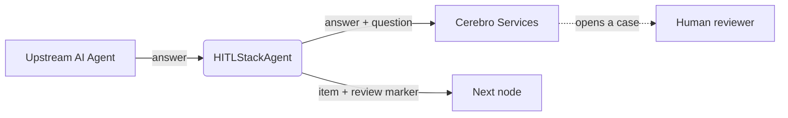

# n8n-nodes-hitl-stack-agent

An [n8n](https://n8n.io) community node that sends an AI agent's answer to
**Cerebro** for **human-in-the-loop review** — without pausing your workflow.

When this node runs, it sends the agent's answer (and, optionally, the upstream
question and context) to Cerebro, which turns it into a **review case** for a
human to approve or correct. The workflow **continues immediately** — the
execution is never parked — so the review happens out-of-band rather than
blocking the run.

[Installation](#installation) · [Credentials](#credentials) ·
[Operations](#operations) · [Node parameters](#node-parameters) ·
[Output](#output) · [Example workflow](#example-workflow) ·
[Compatibility](#compatibility) · [Resources](#resources)

---

## Installation

Follow the
[community node installation guide](https://docs.n8n.io/integrations/community-nodes/installation/)
in the n8n docs.

**In the n8n UI (self-hosted):**

1. Go to **Settings → Community Nodes → Install**.
2. Enter the package name `n8n-nodes-hitl-stack-agent`.
3. Agree to the risks and install.

**Manually (npm):**

```bash
npm install n8n-nodes-hitl-stack-agent
```

After installation the **HITLStackAgent** node appears in the nodes panel.

## Prerequisites

- A running n8n instance (self-hosted, or n8n Cloud once the node is verified).
- A **Cerebro** account with an API gateway Base URL, an API key, and at least
  one agent configured to route answers to human review. Refer to your Cerebro
  documentation for how to set up an agent and enable reviews.

## Credentials

This node uses a single credential type: **Cerebro API** (`cerebroApi`).

| Field | Required | Description |
| --- | --- | --- |
| **Base URL** | yes | Root of your Cerebro API gateway. No default — set it explicitly so your key and review data are never sent to an unintended environment. |
| **API Key** | yes | Your Cerebro API key. |

The credential test verifies that the Base URL and API key are valid. The key
is only used to authenticate with your Cerebro gateway; it is never forwarded to
agents or included in the node output.

## Operations

The node has a single behaviour: **send the current item to Cerebro for review
(non-blocking)**. It does not pause or resume the execution.

- It must receive **exactly one input item** per execution. To review a batch,
  put a **Loop Over Items** node upstream.
- The agent's answer is read from the item's `output` field; the question shown
  to the reviewer is taken from the upstream context (see parameters below).

## Node parameters

| Parameter | Type | Default | Description |
| --- | --- | --- | --- |
| **Agent Name or ID** | options (loaded from Cerebro) | – | Which Cerebro agent the review belongs to, so cases can be grouped per agent. Choose from the list, or supply an ID via an expression. Required. |
| **Include Upstream Context** | boolean | `true` | Also look back at the preceding nodes so the reviewer sees the **question**, not just the answer. |
| **Context Depth** | number | `2` | How many nodes back to walk when context is enabled. `2` covers an AI Agent and whatever fed it. Higher values include more of the workflow. |

## Output

The node passes the input item through and adds a `review` object describing what
was sent:

```json
{
  "output": "…the agent answer…",
  "review": {
    "mode": "cerebro",
    "status": "pending",
    "agentId": "ag_...",
    "traceId": "…correlation id…",
    "delivered": true,
    "acceptedSpans": 1
  }
}
```

- `status` is `"pending"` only when Cerebro accepted the answer for review;
  otherwise it is `"failed"` — so a delivery failure never reads downstream as
  "awaiting human input".
- `delivered` / `acceptedSpans` reflect Cerebro's response. Delivery is
  best-effort: a transport error is reported on the item (and `status: failed`)
  rather than throwing, so a telemetry hiccup doesn't fail your workflow item.
- `traceId` lets you correlate the n8n run with the Cerebro review case.

## How it works



The node collects the agent's answer (and, optionally, the upstream question and
context) and hands it to **Cerebro**, which handles reviewing internally and
opens a case for a human. How Cerebro processes and routes that data is its own
concern — this node treats it as a black box and does not wait for the review.

## Example workflow

```
Chat Trigger → AI Agent (+ chat model) → HITLStackAgent → (next steps)
```

1. The AI Agent produces an answer on `output`.
2. **HITLStackAgent** (with an Agent selected and *Include Upstream Context* on)
   sends the question + answer to Cerebro and continues.
3. A reviewer sees the case in Cerebro; your workflow proceeds in parallel.

## Compatibility

- Requires n8n `1.x` or newer (`n8nNodesApiVersion: 1`).
- Node.js `>=20`.
- No run-time dependencies — the node uses only the `n8n-workflow` peer API and
  Node's built-in `crypto`.

## Limitations

- Handles one item per execution (use **Loop Over Items** for batches).
- The agent's answer must be on the item's `output` field.
- Model name and token usage are not captured in an *AI Agent + chat-model
  sub-node* topology, because n8n does not expose sub-node output to downstream
  nodes.

## Resources

- [n8n community nodes documentation](https://docs.n8n.io/integrations/community-nodes/)
- [Creating nodes](https://docs.n8n.io/integrations/creating-nodes/)

## License

[MIT](LICENSE.md)
